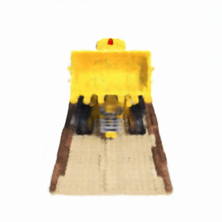

# NeRF meets MLX

Implementations of NeRF (Neural Radiance Fields) and its variants, using `mlx` framework

# Installation

* *Currently, this repository is only tested on **Apple M3 Max Macbook**. <br>
Validations with different Apple Silion setups are welcomed!*

Please setup a virtual environment with your preference:
```shell
# 1. venv name of your choice
$ conda create --name {YOUR_ENV_NAME} python=3.9
$ conda activate {YOUR_ENV_NAME}
$ pip install -r requirements.txt

# 2. one-shot installation; venv with name=`mlx_nerf` will be created
$ conda env create -f environment.yaml
$ conda activate mlx_nerf
```

# Running

In project root directory, 

```shell
$ python mlx_nerf
```

# Implementations

## Image Learning


## Volume Learning

Implementation of Neural Radiance Fields [ECCV2020]. <p>

<p align="center">
    
</p>

Work in Progress.

- [x] Coarse NeRF learning
- [ ] Importance Sampling from coarse NeRF's transmittance
- [ ] Fine NeRF learning
- [ ] Learning rate decaying scheme
